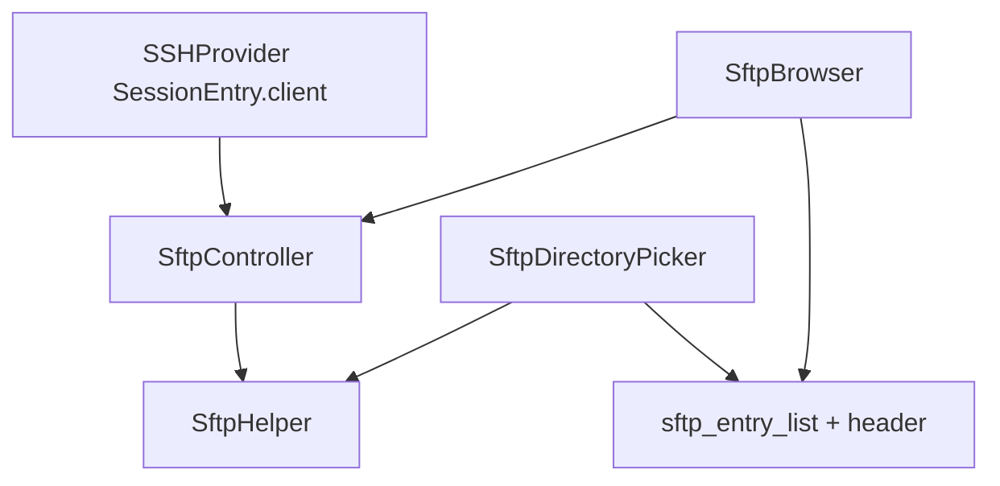

# SFTP Explorer Foundations Implementation Plan

> **For agentic workers:** REQUIRED SUB-SKILL: Use superpowers:subagent-driven-development (recommended) or superpowers:executing-plans to implement this plan task-by-task. Steps use checkbox (`- [ ]`) syntax for tracking.

**Goal:** Turn PocketShell’s minimal SFTP browse/upload/download into a solid remote file explorer (attrs, sort/filter, mkdir/rename/delete, transfer progress, capped preview/edit) on the existing Android→Windows stack—without building a split-pane “workstation” shell.

**Architecture:** Keep one SSH session’s `SSHClient` as the transport. Extend [`lib/services/sftp_helper.dart`](../../../lib/services/sftp_helper.dart) with a typed `RemoteFsEntry` model, Windows-aware paths, and file ops. Introduce a session-scoped `SftpController` (`ChangeNotifier`) for listing/sort/filter/transfers. Share list/header/context UI between [`lib/widgets/sftp_browser.dart`](../../../lib/widgets/sftp_browser.dart) and [`lib/widgets/sftp_directory_picker.dart`](../../../lib/widgets/sftp_directory_picker.dart). Persist sort prefs and last SFTP path via `ConfigService`.

**Tech Stack:** Flutter, Provider/`ChangeNotifier`, `dartssh2` ^2.22 (`SftpFileAttrs.size` / `modifyTime`, `rename` / `mkdir` / `remove` / `rmdir`), `file_picker`, `shared_preferences` via ConfigService.

## Source of truth (supersedes external drafts)

This document **replaces** the following external drafts and is the only SFTP enhancement plan agents should follow:

- `Implementierungsplan für die PocketShell Workstation.md` (UX wish list; wrong paths `sftp_provider.dart` / `sftp_screen.dart`)
- `Technische Roadmap für PocketShell SFTP-Optimierungen.md` (empty Studio stub; no actionable content)

Do **not** invent `lib/screens/sftp_screen.dart`. Work in helper + widgets (+ new controller/model/utils under `lib/`).

## Global Constraints

- Primary target: **Android client → Windows hosts** (drive letters `C:/`, path joining must not break `C:/Users/...`).
- Agents directory pick must use the **same** listing/navigation core as the Client SFTP browser.
- Persist user prefs only through **ConfigService** (never call `shared_preferences` from widgets).
- Reuse the connected session’s `SSHClient`; do not open a second SSH connection for SFTP.
- Cap in-memory reads for preview/edit (default **512 KiB**); refuse larger files with a clear SnackBar.
- No split terminal|files pane, no IDE-style multi-pane “Pocket Workstation” shell in this plan (see Out of scope).
- Keep Server tab optional; do not couple SFTP work to Server.
- Run `flutter analyze` and `flutter test` after each task group; add unit tests for pure logic (paths, sort/filter).
- Use `package:` imports; `strict-casts` / `strict-raw-types` compliance.

## Out of scope (deferred — separate product decision)

| Deferred item | Why |
|---------------|-----|
| Split-pane terminal + files / “Pocket Workstation” chrome | Phone-first Client tab; modal SFTP is intentional for now |
| Auto terminal↔SFTP `pwd` sync on tab open | Shell cwd is not a reliable API across cmd/PowerShell; path forms differ from SFTP |
| Grid view with remote image thumbnails | Expensive over SFTP; needs listing cache first |
| Recursive folder upload/download, transfer queue, resume | After single-file progress/cancel works |
| Dual-pane local↔remote sync / drag-drop | Desktop-centric; not this pass |
| chmod / symlink / checksums | Not required for primary Android→Windows workflow |

**Optional later (Task 8 only if prior tasks ship):** manual “Sync path from shell” after a proven cwd probe—not auto-open.

## File map

| File | Responsibility |
|------|----------------|
| Create: `lib/models/remote_fs_entry.dart` | Typed remote listing entry |
| Create: `lib/utils/remote_path_utils.dart` | Join/parent/normalize for `/` and `C:/` paths |
| Create: `lib/utils/remote_fs_sort.dart` | Filter + sort pure functions |
| Create: `lib/providers/sftp_controller.dart` | Session-scoped listing/sort/filter/ops/transfer state |
| Modify: `lib/services/sftp_helper.dart` | Attrs, ops, reusable `SftpClient`, drive cache |
| Modify: `lib/services/config_service.dart` | SFTP sort prefs + last path |
| Create: `lib/widgets/sftp/sftp_browser_header.dart` | Path, search, sort, drives, copy |
| Create: `lib/widgets/sftp/sftp_entry_list.dart` | Shared list + context sheet |
| Create: `lib/widgets/sftp/sftp_transfer_banner.dart` | Progress + cancel |
| Create: `lib/widgets/sftp/sftp_text_preview.dart` | Capped text view/edit |
| Create: `lib/widgets/sftp/sftp_image_preview.dart` | Capped image preview |
| Modify: `lib/widgets/sftp_browser.dart` | Wire controller + shared widgets |
| Modify: `lib/widgets/sftp_directory_picker.dart` | Wire shared list (dirs-only mode) |
| Create: `test/remote_path_utils_test.dart` | Path tests |
| Create: `test/remote_fs_sort_test.dart` | Sort/filter tests |
| Create: `test/sftp_helper_listing_test.dart` | Mapping attrs (fake/`SftpName` if practical; else document manual) |



---

### Task 1: RemoteFsEntry + Windows-aware path utils

**Files:**
- Create: `lib/models/remote_fs_entry.dart`
- Create: `lib/utils/remote_path_utils.dart`
- Test: `test/remote_path_utils_test.dart`

**Interfaces:**
- Produces: `RemoteFsEntry`, `RemotePath.join`, `RemotePath.parent`, `RemotePath.isRoot`, `RemotePath.normalize`

- [ ] **Step 1: Write the failing path tests**

```dart
import 'package:flutter_test/flutter_test.dart';
import 'package:ssh_app/utils/remote_path_utils.dart';

void main() {
  group('RemotePath.join', () {
    test('joins unix segments', () {
      expect(RemotePath.join('/home/user', 'docs'), '/home/user/docs');
    });

    test('joins windows drive paths without dropping drive', () {
      expect(RemotePath.join('C:/', 'Users'), 'C:/Users');
      expect(RemotePath.join('C:/Users', 'lukas'), 'C:/Users/lukas');
    });

    test('strips duplicate slashes', () {
      expect(RemotePath.join('C:/Users/', '/lukas'), 'C:/Users/lukas');
    });
  });

  group('RemotePath.parent', () {
    test('parent of nested unix path', () {
      expect(RemotePath.parent('/a/b/c'), '/a/b');
    });

    test('parent of drive root is itself', () {
      expect(RemotePath.parent('C:/'), 'C:/');
    });

    test('parent under drive', () {
      expect(RemotePath.parent('C:/Users'), 'C:/');
    });
  });

  group('RemotePath.isRoot', () {
    test('unix and drive roots', () {
      expect(RemotePath.isRoot('/'), isTrue);
      expect(RemotePath.isRoot('C:/'), isTrue);
      expect(RemotePath.isRoot('C:/Users'), isFalse);
    });
  });
}
```

- [ ] **Step 2: Run tests — expect FAIL**

```bash
flutter test test/remote_path_utils_test.dart
```

Expected: FAIL (library/types missing).

- [ ] **Step 3: Implement model + path utils**

```dart
// lib/models/remote_fs_entry.dart
class RemoteFsEntry {
  const RemoteFsEntry({
    required this.name,
    required this.isDirectory,
    this.size,
    this.modifyTime,
  });

  final String name;
  final bool isDirectory;
  final int? size;
  /// Seconds since epoch (SFTP mtime), if provided by server.
  final int? modifyTime;

  bool get isParentLink => name == '..';
}
```

```dart
// lib/utils/remote_path_utils.dart
abstract final class RemotePath {
  static String normalize(String path) {
    var p = path.replaceAll('\\', '/');
    if (p.length > 1 && p.endsWith('/')) {
      final drive = RegExp(r'^[A-Za-z]:/$').hasMatch(p);
      if (!drive) p = p.substring(0, p.length - 1);
    }
    if (p.isEmpty) return '/';
    return p;
  }

  static bool isRoot(String path) {
    final p = normalize(path);
    if (p == '/' || p == '.') return true;
    return RegExp(r'^[A-Za-z]:/$').hasMatch(p);
  }

  static String join(String base, String name) {
    final b = normalize(base);
    final n = name.replaceAll('\\', '/');
    if (n == '..') return parent(b);
    if (n.startsWith('/')) {
      // Absolute unix path — ignore base.
      return normalize(n);
    }
    if (RegExp(r'^[A-Za-z]:/').hasMatch(n)) return normalize(n);
    if (b == '/') return '/$n';
    if (RegExp(r'^[A-Za-z]:/$').hasMatch(b)) return '$b$n';
    return '$b/$n';
  }

  static String parent(String path) {
    final p = normalize(path);
    if (isRoot(p)) return p;
    final i = p.lastIndexOf('/');
    if (i <= 0) return '/';
    // Keep "C:/" when stripping the last segment of "C:/Users".
    if (RegExp(r'^[A-Za-z]:/').hasMatch(p) && i == 2) {
      return '${p.substring(0, 3)}'; // "C:/"
    }
    return p.substring(0, i);
  }
}
```

- [ ] **Step 4: Run tests — expect PASS**

```bash
flutter test test/remote_path_utils_test.dart
```

- [ ] **Step 5: Commit**

```bash
git add lib/models/remote_fs_entry.dart lib/utils/remote_path_utils.dart test/remote_path_utils_test.dart
git commit -m "feat(sftp): add RemoteFsEntry and Windows-aware remote paths"
```

---

### Task 2: Extend SftpHelper (attrs, ops, reusable client, drive cache)

**Files:**
- Modify: `lib/services/sftp_helper.dart`
- Modify call sites that use `List<Map<String, dynamic>>` from `listDirWithType`
- Test: prefer unit tests around mapping; integration needs a live host

**Interfaces:**
- Consumes: `RemoteFsEntry`, `RemotePath`
- Produces: `Future<List<RemoteFsEntry>> listDir(String path)`, `mkdir`, `rename`, `removeFile`, `removeDir`, `downloadStream` / `upload` with optional `onProgress` + `cancelToken`, cached `listDrives`

- [ ] **Step 1: Replace map-based listing with typed entries**

Change `listDirWithType` to:

```dart
Future<List<RemoteFsEntry>> listDir(String path) async {
  final sftp = await _sftp();
  final names = await sftp.listdir(path);
  final entries = <RemoteFsEntry>[];
  for (final n in names) {
    final name = n.filename.toString();
    if (name == '.' || name == '..') continue;
    entries.add(
      RemoteFsEntry(
        name: name,
        isDirectory: n.attr.isDirectory,
        size: n.attr.size,
        modifyTime: n.attr.modifyTime,
      ),
    );
  }
  return entries;
}

@Deprecated('Use listDir')
Future<List<Map<String, dynamic>>> listDirWithType(String path) async {
  final entries = await listDir(path);
  return entries
      .map(
        (e) => <String, dynamic>{
          'name': e.name,
          'isDirectory': e.isDirectory,
        },
      )
      .toList();
}
```

Keep a short-lived compatibility shim **only until** browser/picker are migrated in Task 5; then delete `listDirWithType`.

- [ ] **Step 2: Reuse one SftpClient per helper instance**

```dart
SftpClient? _client;

Future<SftpClient> _sftp() async {
  return _client ??= await client.sftp();
}

Future<void> close() async {
  _client?.close();
  _client = null;
}
```

Call `close()` from `SftpController.dispose`.

- [ ] **Step 3: Add mkdir / rename / remove**

```dart
Future<void> mkdir(String path) async {
  final sftp = await _sftp();
  await sftp.mkdir(path);
}

Future<void> rename(String from, String to) async {
  final sftp = await _sftp();
  await sftp.rename(from, to);
}

Future<void> removeFile(String path) async {
  final sftp = await _sftp();
  await sftp.remove(path);
}

Future<void> removeDir(String path) async {
  final sftp = await _sftp();
  await sftp.rmdir(path);
}
```

- [ ] **Step 4: Cache drives for the helper lifetime**

```dart
List<String>? _drives;

Future<List<String>> listDrives({bool forceRefresh = false}) async {
  if (_drives != null && !forceRefresh) return List<String>.from(_drives!);
  final sftp = await _sftp();
  final found = <String>[];
  for (var code = 'C'.codeUnitAt(0); code <= 'Z'.codeUnitAt(0); code++) {
    final letter = String.fromCharCode(code);
    try {
      await sftp.listdir('$letter:/');
      found.add(letter);
    } catch (_) {}
  }
  _drives = found;
  return List<String>.from(found);
}
```

- [ ] **Step 5: Add progress + cancel hooks on upload/download**

```dart
typedef SftpProgress = void Function(int bytesTransferred, int? totalBytes);

class SftpCancelToken {
  bool isCancelled = false;
  void cancel() => isCancelled = true;
}

Future<void> downloadStream(
  String remotePath,
  File localFile, {
  SftpProgress? onProgress,
  SftpCancelToken? cancelToken,
  int? knownSize,
}) async {
  final sftp = await _sftp();
  final remoteFile = await sftp.open(remotePath, mode: SftpFileOpenMode.read);
  final sink = localFile.openWrite();
  var transferred = 0;
  try {
    await for (final chunk in remoteFile.read()) {
      if (cancelToken?.isCancelled == true) {
        throw StateError('Transfer cancelled');
      }
      if (chunk.isEmpty) continue;
      sink.add(chunk);
      transferred += chunk.length;
      onProgress?.call(transferred, knownSize);
    }
    await sink.flush();
  } finally {
    await remoteFile.close();
    await sink.close();
  }
}

// Mirror the same cancel/progress pattern in upload().
```

- [ ] **Step 6: Analyze**

```bash
flutter analyze lib/services/sftp_helper.dart
```

- [ ] **Step 7: Commit**

```bash
git add lib/services/sftp_helper.dart
git commit -m "feat(sftp): typed listing, file ops, reusable client, transfer hooks"
```

---

### Task 3: Sort/filter pure logic + ConfigService prefs

**Files:**
- Create: `lib/utils/remote_fs_sort.dart`
- Modify: `lib/services/config_service.dart`
- Test: `test/remote_fs_sort_test.dart`

**Interfaces:**
- Produces: `enum RemoteFsSortField { name, date, size, type }`, `applyRemoteFsView(...)`, ConfigService `sftp_sort_field`, `sftp_sort_ascending`, `sftp_last_path`

- [ ] **Step 1: Write failing sort/filter tests**

```dart
import 'package:flutter_test/flutter_test.dart';
import 'package:ssh_app/models/remote_fs_entry.dart';
import 'package:ssh_app/utils/remote_fs_sort.dart';

void main() {
  final entries = <RemoteFsEntry>[
    const RemoteFsEntry(name: 'b.txt', isDirectory: false, size: 20, modifyTime: 2),
    const RemoteFsEntry(name: 'a_dir', isDirectory: true, size: 0, modifyTime: 3),
    const RemoteFsEntry(name: 'A.txt', isDirectory: false, size: 10, modifyTime: 1),
  ];

  test('filter is case-insensitive substring', () {
    final out = applyRemoteFsView(
      entries,
      filter: 'a.',
      field: RemoteFsSortField.name,
      ascending: true,
    );
    expect(out.map((e) => e.name), ['A.txt']);
  });

  test('directories sort before files when sorting by name', () {
    final out = applyRemoteFsView(
      entries,
      filter: '',
      field: RemoteFsSortField.name,
      ascending: true,
    );
    expect(out.first.name, 'a_dir');
  });

  test('sort by size ascending', () {
    final out = applyRemoteFsView(
      entries.where((e) => !e.isDirectory).toList(),
      filter: '',
      field: RemoteFsSortField.size,
      ascending: true,
    );
    expect(out.map((e) => e.name), ['A.txt', 'b.txt']);
  });
}
```

- [ ] **Step 2: Implement sort/filter**

```dart
// lib/utils/remote_fs_sort.dart
import 'package:ssh_app/models/remote_fs_entry.dart';

enum RemoteFsSortField { name, date, size, type }

List<RemoteFsEntry> applyRemoteFsView(
  List<RemoteFsEntry> source, {
  required String filter,
  required RemoteFsSortField field,
  required bool ascending,
}) {
  final q = filter.trim().toLowerCase();
  final filtered = q.isEmpty
      ? List<RemoteFsEntry>.from(source)
      : source.where((e) => e.name.toLowerCase().contains(q)).toList();

  int cmp(RemoteFsEntry a, RemoteFsEntry b) {
    if (a.isDirectory != b.isDirectory) {
      return a.isDirectory ? -1 : 1;
    }
    int raw;
    switch (field) {
      case RemoteFsSortField.name:
        raw = a.name.toLowerCase().compareTo(b.name.toLowerCase());
      case RemoteFsSortField.date:
        raw = (a.modifyTime ?? 0).compareTo(b.modifyTime ?? 0);
      case RemoteFsSortField.size:
        raw = (a.size ?? 0).compareTo(b.size ?? 0);
      case RemoteFsSortField.type:
        final ae = a.name.contains('.') ? a.name.split('.').last : '';
        final be = b.name.contains('.') ? b.name.split('.').last : '';
        raw = ae.toLowerCase().compareTo(be.toLowerCase());
        if (raw == 0) {
          raw = a.name.toLowerCase().compareTo(b.name.toLowerCase());
        }
    }
    return ascending ? raw : -raw;
  }

  filtered.sort(cmp);
  return filtered;
}
```

- [ ] **Step 3: Persist prefs on ConfigService**

Add keys and getters/setters:

```dart
static const String _sftpSortFieldKey = 'sftp_sort_field';
static const String _sftpSortAscendingKey = 'sftp_sort_ascending';
static const String _sftpLastPathKey = 'sftp_last_path';

static Future<String> getSftpSortField() async =>
    prefs.getString(_sftpSortFieldKey) ?? 'name';

static Future<void> saveSftpSortField(String field) async =>
    prefs.setString(_sftpSortFieldKey, field);

static Future<bool> getSftpSortAscending() async =>
    prefs.getBool(_sftpSortAscendingKey) ?? true;

static Future<void> saveSftpSortAscending(bool ascending) async =>
    prefs.setBool(_sftpSortAscendingKey, ascending);

static Future<String?> getSftpLastPath() async =>
    prefs.getString(_sftpLastPathKey);

static Future<void> saveSftpLastPath(String path) async =>
    prefs.setString(_sftpLastPathKey, path);
```

- [ ] **Step 4: Run tests**

```bash
flutter test test/remote_fs_sort_test.dart
```

- [ ] **Step 5: Commit**

```bash
git add lib/utils/remote_fs_sort.dart lib/services/config_service.dart test/remote_fs_sort_test.dart
git commit -m "feat(sftp): sort/filter helpers and ConfigService prefs"
```

---

### Task 4: SftpController (session-scoped ChangeNotifier)

**Files:**
- Create: `lib/providers/sftp_controller.dart`

**Interfaces:**
- Consumes: `SftpHelper`, `applyRemoteFsView`, ConfigService, `RemotePath`
- Produces: `SftpController` with `currentPath`, `visibleEntries`, `drives`, `loading`, `error`, `filterTerm`, sort fields, transfer progress, `refresh` / `navigate` / `mkdir` / `rename` / `delete` / `upload` / `download` / `cancelTransfer`

- [ ] **Step 1: Implement controller skeleton**

```dart
// lib/providers/sftp_controller.dart
import 'dart:io';

import 'package:dartssh2/dartssh2.dart';
import 'package:flutter/foundation.dart';

import 'package:ssh_app/models/remote_fs_entry.dart';
import 'package:ssh_app/services/config_service.dart';
import 'package:ssh_app/services/sftp_helper.dart';
import 'package:ssh_app/utils/remote_fs_sort.dart';
import 'package:ssh_app/utils/remote_path_utils.dart';

class SftpController extends ChangeNotifier {
  SftpController({required SSHClient client}) : _helper = SftpHelper(client);

  final SftpHelper _helper;

  String currentPath = '/';
  List<RemoteFsEntry> _raw = <RemoteFsEntry>[];
  List<String> drives = <String>[];
  bool loading = false;
  String? error;
  String filterTerm = '';
  RemoteFsSortField sortField = RemoteFsSortField.name;
  bool sortAscending = true;

  int? transferBytes;
  int? transferTotal;
  String? transferLabel;
  SftpCancelToken? _cancel;

  List<RemoteFsEntry> get visibleEntries => applyRemoteFsView(
        _raw,
        filter: filterTerm,
        field: sortField,
        ascending: sortAscending,
      );

  Future<void> init({String? initialPath}) async {
    sortField = RemoteFsSortField.values.firstWhere(
      (f) => f.name == await ConfigService.getSftpSortField(),
      orElse: () => RemoteFsSortField.name,
    );
    sortAscending = await ConfigService.getSftpSortAscending();
    drives = await _helper.listDrives();
    final saved = initialPath ?? await ConfigService.getSftpLastPath();
    if (saved != null && saved.isNotEmpty) {
      currentPath = RemotePath.normalize(saved);
    } else if (drives.isNotEmpty) {
      currentPath = '${drives.first}:/';
    } else {
      currentPath = '/';
    }
    await refresh();
  }

  Future<void> refresh() async {
    loading = true;
    error = null;
    notifyListeners();
    try {
      _raw = await _helper.listDir(currentPath);
      await ConfigService.saveSftpLastPath(currentPath);
    } catch (e) {
      error = e.toString();
      _raw = <RemoteFsEntry>[];
    } finally {
      loading = false;
      notifyListeners();
    }
  }

  Future<void> navigateTo(String path) async {
    currentPath = RemotePath.normalize(path);
    filterTerm = '';
    await refresh();
  }

  Future<void> openEntry(RemoteFsEntry entry) async {
    if (!entry.isDirectory) return;
    if (entry.isParentLink) {
      await navigateTo(RemotePath.parent(currentPath));
      return;
    }
    await navigateTo(RemotePath.join(currentPath, entry.name));
  }

  void setFilter(String value) {
    filterTerm = value;
    notifyListeners();
  }

  Future<void> setSort(RemoteFsSortField field, {bool? ascending}) async {
    sortField = field;
    if (ascending != null) sortAscending = ascending;
    await ConfigService.saveSftpSortField(field.name);
    await ConfigService.saveSftpSortAscending(sortAscending);
    notifyListeners();
  }

  // mkdir / rename / deleteEntry / upload / download / cancelTransfer
  // follow the same try/catch + refresh pattern; set transfer* during I/O.

  @override
  void dispose() {
    _cancel?.cancel();
    _helper.close();
    super.dispose();
  }
}
```

Complete `mkdir`, `rename`, `deleteEntry`, `upload`, `download`, and `cancelTransfer` in the same file using `RemotePath.join` and helper methods from Task 2. On delete: use `removeDir` when `entry.isDirectory`, else `removeFile`. Confirm overwrite in the UI layer before calling upload/download when the local/remote target exists.

- [ ] **Step 2: Analyze**

```bash
flutter analyze lib/providers/sftp_controller.dart
```

- [ ] **Step 3: Commit**

```bash
git add lib/providers/sftp_controller.dart
git commit -m "feat(sftp): add session-scoped SftpController"
```

---

### Task 5: Shared UI + refactor browser and directory picker

**Files:**
- Create: `lib/widgets/sftp/sftp_browser_header.dart`
- Create: `lib/widgets/sftp/sftp_entry_list.dart`
- Create: `lib/widgets/sftp/sftp_transfer_banner.dart`
- Modify: `lib/widgets/sftp_browser.dart`
- Modify: `lib/widgets/sftp_directory_picker.dart`

**Interfaces:**
- Consumes: `SftpController` (browser) or lightweight listing callbacks (picker may own a controller with `dirsOnly: true` filter)
- Produces: shared header (search, sort menu, path copy, compact drive dropdown), entry list with long-press sheet (Rename / Delete / Copy path / Preview when enabled)

- [ ] **Step 1: Header widget**

Implement a compact AppBar-like row:

- Current path `Text` (ellipsis) + `IconButton` copy → `Clipboard.setData`
- Expandable search `TextField` bound to `controller.setFilter`
- `PopupMenuButton` for sort field + ascending toggle
- Drive selector: `DropdownButton<String>` of `drives` (replaces wide horizontal chip row); on change → `navigateTo('$letter:/')`
- Actions: refresh, mkdir (prompt), upload (browser only)

- [ ] **Step 2: Entry list + context sheet**

```dart
// Pseudocode structure — implement fully in file
ListView.builder(
  itemCount: entries.length + (showParent ? 1 : 0),
  itemBuilder: ...,
)
```

Each tile shows name, folder/file icon, optional subtitle (`size` / formatted mtime). Long-press / trailing menu → modal bottom sheet:

- Copy path (`RemotePath.join(currentPath, name)`)
- Rename (dialog → `controller.rename`)
- Delete (confirm → `controller.deleteEntry`)
- Edit / Preview (wired in Task 6/7; hide until those land if preferred)

For directory picker mode: only show directories; primary action = select current path; no upload/download.

- [ ] **Step 3: Transfer banner**

When `transferLabel != null`, show a linear progress (`transferBytes / transferTotal` or indeterminate) + Cancel calling `controller.cancelTransfer()`.

- [ ] **Step 4: Refactor `SftpBrowser`**

- Create `SftpController` in `initState` from `SSHProvider` session client
- `ListenableBuilder` / `AnimatedBuilder` around header + list + banner
- Remove local `Map` listing / drive chip row
- Keep modal height ~0.7 screen as today unless UX regresses

- [ ] **Step 5: Refactor `SftpDirectoryPicker`**

- Same header/list (dirs only): filter `visibleEntries.where((e) => e.isDirectory || e.isParentLink)` **or** pass `directoriesOnly: true` into a shared list widget
- On confirm: `Navigator.pop(context, controller.currentPath)`
- Still requires connected `SSHClient` (existing Agents constraint)

- [ ] **Step 6: Delete deprecated `listDirWithType` if unused**

- [ ] **Step 7: Verify**

```bash
flutter analyze
flutter test
```

- [ ] **Step 8: Commit**

```bash
git add lib/widgets/sftp/ lib/widgets/sftp_browser.dart lib/widgets/sftp_directory_picker.dart lib/services/sftp_helper.dart
git commit -m "feat(sftp): shared explorer UI with sort, filter, and file ops"
```

---

### Task 6: Transfer progress UX (single-file)

**Files:**
- Modify: `lib/providers/sftp_controller.dart` (ensure upload/download set progress)
- Modify: `lib/widgets/sftp/sftp_transfer_banner.dart`
- Modify: `lib/widgets/sftp_browser.dart` (wire FilePicker + known size when available)

- [ ] **Step 1: On download, pass `knownSize` from `RemoteFsEntry.size`**

- [ ] **Step 2: On upload, use `localFile.length()` as total**

- [ ] **Step 3: SnackBar success/failure; delete partial local file on cancel/failure for downloads**

- [ ] **Step 4: Manual test checklist (Android → Windows)**

- Upload small file → progress moves → completes
- Cancel mid-download → no corrupt success SnackBar
- Disconnect SSH mid-transfer → error surfaced

- [ ] **Step 5: Commit**

```bash
git commit -am "feat(sftp): single-file transfer progress and cancel"
```

---

### Task 7: Capped text edit + image preview

**Files:**
- Create: `lib/widgets/sftp/sftp_text_preview.dart`
- Create: `lib/widgets/sftp/sftp_image_preview.dart`
- Modify: `lib/services/sftp_helper.dart` — `readRemoteBytes(path, {int maxBytes})`
- Modify: context sheet in `sftp_entry_list.dart`

**Constants:**

```dart
const int kSftpPreviewMaxBytes = 512 * 1024;
```

- [ ] **Step 1: `readRemoteBytes` with hard cap**

If `attr.size != null && size > maxBytes`, throw a typed/`StateError` *before* reading. Otherwise stream until `maxBytes` and abort if exceeded.

- [ ] **Step 2: Text preview/editor**

- Allow extensions: `.txt`, `.md`, `.ini`, `.env`, `.json`, `.yaml`, `.yml`, `.xml`, `.log`, `.csv`
- Show `TextField` (multiline) for edit; Save writes via SFTP open truncate+write
- Refuse binary / oversize with SnackBar

- [ ] **Step 3: Image preview**

- Allow `.png`, `.jpg`, `.jpeg`, `.gif`, `.webp`
- `Image.memory` after capped byte read; no grid thumbnails in list

- [ ] **Step 4: Wire context actions Edit / Preview**

- [ ] **Step 5: Analyze + test**

```bash
flutter analyze
flutter test
```

- [ ] **Step 6: Commit**

```bash
git commit -am "feat(sftp): capped remote text edit and image preview"
```

---

### Task 8 (optional): Manual shell path sync only

**Do not start until Tasks 1–7 are done and stable.**

**Files:**
- Modify: `lib/providers/ssh_provider.dart` / session model only if a safe probe API is added
- Modify: `lib/widgets/sftp/sftp_browser_header.dart` — button “Open at shell path”

**Approach (manual only):**

1. Probe cwd by writing a unique marker command to the shell and parsing one line of output **or** maintain an app-tracked cwd if the product later adds structured `cd` helpers.
2. Normalize Windows `\` → `/` for SFTP.
3. Call `controller.navigateTo(probedPath)` on button press.
4. **No** automatic navigate when opening the SFTP sheet.

If probe is unreliable on PowerShell vs cmd during QA, **ship without this task** and keep last SFTP path from ConfigService only.

---

## Acceptance criteria (plan complete when)

- [ ] Listing shows size and/or date when the server provides attrs; sort/filter work offline on the cached listing
- [ ] mkdir, rename, delete work from the Client SFTP UI
- [ ] Agents directory picker navigates with the same path/drive/header behavior
- [ ] Single-file upload/download show progress and support cancel
- [ ] Text/image preview refuse files over 512 KiB
- [ ] `flutter analyze` clean for touched files; new unit tests pass
- [ ] No split-pane workstation UI landed

## Manual QA matrix (Android → Windows)

| Case | Expect |
|------|--------|
| Open SFTP on connected session | Starts at last path or first drive |
| Switch drive via dropdown | Lists that drive root |
| Search `*.log` substring | Filters current listing |
| Sort by size | Files ordered; dirs still first |
| Rename file | Refresh shows new name |
| Delete empty dir | Removed; non-empty fails with error |
| Upload + cancel | Cancel stops; no success toast |
| Preview 1 MB png | Rejected with size message |
| Agents pick directory | Returns path; OpenCode scope still works |

---

## Self-review checklist

1. **Spec coverage:** External wish-list items mapped — sort/filter/attrs, path copy, search, compact drives, context rename/delete, text edit, image preview. Wish-list auto pwd sync deferred to optional Task 8 (manual only). Grid thumbnails / split workstation explicitly out of scope.
2. **No phantom files:** Plan targets `sftp_helper.dart`, `sftp_browser.dart`, `sftp_directory_picker.dart`, plus new model/utils/controller/shared widgets — not `sftp_screen.dart`.
3. **Foundations-first order:** paths → helper ops → sort prefs → controller → shared UI → transfers → capped preview → optional manual cwd.
4. **Type names consistent:** `RemoteFsEntry`, `RemotePath`, `RemoteFsSortField`, `SftpController`, `SftpCancelToken`, `kSftpPreviewMaxBytes`.
